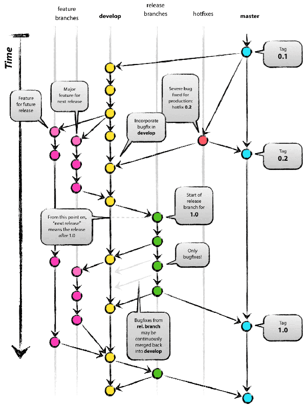

# MemorySharp #

## Synopsis ##

MemorySharp is a C# based memory editing library targeting Windows applications, offering various functions to extract and inject data and codes into remote processes to allow interoperability.

The goal of this library is to provide a safe, powerful and easy to use API, keeping the remote process as clean as possible. For the moment, the library only supports 32-bit development.

MemorySharp is licensed under the MIT License. The license is simple and easy to understand and it places almost no restrictions on what you can do with a project using MemorySharp. You are free to use any MemorySharp project in any other project (even commercial projects) as long as the copyright header is left intact. 

The project is made by [Binarysharp](http://binarysharp.com) and can be downloaded on the [official website](http://binarysharp.com/files/category/7-memorysharp/).

## Features ##

MemorySharp is divided into several parts. Here is list the all the features available.

- **Process interactions**
 - Check if the process is debugged
 - Gather information of the process
 - Interact with the PEB (Process Environment Block)

- **Memory interactions**
 - Allocate and free a chunk of memory
 - Change the protection of allocated regions
 - Get an absolute/relative address from a pointer
 - Query the memory allocated
 - Read and write primitive and complex data types

- **Module interactions**
 - Enumerate all modules loaded
 - Find functions inside a module
 - Get the main module
 - Inject and eject modules

- **Thread interactions**
 - Create and terminate threads
 - Get the exit code of terminated threads
 - Get the main thread
 - Get the segments addresses
 - Get threads by identifier
 - Interact with the TEB (Thread Environment Block)
 - Join threads
 - Manage the context of threads
 - Query the state of threads
 - Suspend and resume threads

- **Window interactions**
 - Enumerate the windows of the process
 - Enumerate the child windows of the process
 - Enumerate the child windows of another window
 - Flash the window (once or repeatedly)
 - Get a window by its class name
 - Get a window by its title (or a part of its title)
 - Get the attached thread of a window
 - Get the main window
 - Interact with the keyboard with a window (press and release keys, write texts) without activate it
 - Interact with the mouse with the window (clicks, movement)
 - Post and send message
 - Query the class name
 - Query and modify the title
 - Query and modify the size (height, width) and the position (X, Y)

- **Assembly interactions**
 - Assemble mnemonics
 - Embed FASM compiler ([https://github.com/ZenLulz/Fasm.NET](https://github.com/ZenLulz/Fasm.NET "wrapped by ZenLulz")) 
 - Execute remote codes (such as functions) with/without parameter(s) synchronously and asynchronously
 - Inject mnemonics
 - Support several calling conventions

- **Data types manipulations**
 - Extract useful information from data types
 - Convert a byte array to a managed object
 - Convert a managed object to a byte array
 - Convert a pointer to a managed object
 - Store data in the remote process in safe (collected when unused)

- **Helpers available**
 - ApplicationFinder: Find the right process to interact
 - HandleManipulator: Convert an handle to a process or a thread
 - Generic singleton: Implement a singleton on any of your class
 - Randomizer: Generate random numbers, strings and Guid
 - SerializationHelper: Serialize and deserialize managed object into XML

- **Executor Mechanism** *(not available yet, coming soon)*
- **Hook Mechanism** *(not available yet, coming soon)*
- **Pattern Mechanism** *(not available yet, coming soon)*
- **Patching Mechanism** *(not available yet, coming soon)*

## Community ##

Join the community to submit your feebacks, ideas of improvement, a bug or simply to ask a question of the official board: [MemorySharp Community](http://binarysharp.com/forum/15-memorysharp/).


## Examples ##

### Reading/Write data ###

These are basically two ways to read/write data. The first one is to use the the `MemorySharp` class :

```csharp
var address = IntPtr.Zero;
var sharp = new MemorySharp(Process.GetCurrentProcess());

// Read an array of 3 integers
int[] integers = sharp.Read<int>(address, 3);
// Write a string
sharp.WriteString(address, "I love managed languages.");
```

The second way is to use `RemotePointer` objects. These objects are instanciated using the indexer on `MemorySharp` objects :

```csharp
var address = IntPtr.Zero;
var offset = IntPtr.Zero;
var sharp = new MemorySharp(Process.GetCurrentProcess());

// Read an array of 3 integers
int[] integers = sharp[address].Read<int>(offset, 3);
// Write a string
sharp[address].WriteString("I love managed languages.");
```

### Execute/Inject code ###

Executing code is very similar to read and write memory. The `Assembly` factory can be used :

```csharp
var address = IntPtr.Zero;
var sharp = new MemorySharp(Process.GetCurrentProcess());

// Execute code and get the return value as boolean
var ret = sharp.Assembly.Execute<bool>(address);
```

Using RemotePointer is also possible :

```csharp
var address = IntPtr.Zero;
var sharp = new MemorySharp(Process.GetCurrentProcess());

// Execute code and get the return value as a Vector3 structure
var vector = sharp[address].Execute<Vector3>(address, "a parameter", "another one");
```

The parameters like `string` are dynamically allocated in the remote process memory and freed as soon as the execution of the code terminated.

Here, some FASM mnemonics are injected at a given address :

```csharp
var address = IntPtr.Zero;
var sharp = new MemorySharp(Process.GetCurrentProcess());

// Inject mnemonics
sharp.Assembly.Inject(
    new[]
        {
            "push 0",
            "add esp, 4",
            "retn"
        },
    address);
```

Lazy people will enjoy the assembly transactions to remote inject and execute code :

```csharp
var address = IntPtr.Zero;
var sharp = new MemorySharp(Process.GetCurrentProcess());

// Inject and execute code lazily
using(var t = sharp.Assembly.BeginTransaction())
{
	t.AddLine("mov eax, {0}", address);
	t.AddLine("call eax");
	t.AddLine("retn");
}
```

The code is then automatically executed in the remote process.

### Thread-and-play ###

Here are some examples to show how it's easy to play with remote threads.

Hijacking a thread :

```csharp
var sharp = new MemorySharp(Process.GetCurrentProcess());

sharp.Threads.MainThread.Context.Eip = address;
```

What ? Yes of course... the code suspends and resumes the thread when changing its context.

Freeze the application :

```csharp
var sharp = new MemorySharp(Process.GetCurrentProcess());

sharp.Threads.SuspendAll();
```

Extract specific information from the TEB :

```csharp
var sharp = new MemorySharp(Process.GetCurrentProcess());

var tlsPtr = sharp.Threads.MainThread.Teb.Tls;
```

TLS cloning (only for the demo, it would be quite evil to really do that) :

```csharp
var sharp = new MemorySharp(Process.GetCurrentProcess());

sharp.Threads.RemoteThreads.First().Teb.TlsSlots = sharp.Threads.RemoteThreads.Last().Teb.TlsSlots;
```

### Inject/eject Modules ###

Here a module is injected and ejected using the `IDisposable` interface :

```csharp
string path = [..];
var sharp = new MemorySharp(Process.GetCurrentProcess());

using (var module = sharp.Modules.Inject(path))
{
    module.FindFunction("MessageBoxW").Execute(0, "Hey", "Title", 0);
}
```

One more time, using indexer here is interesting :

```csharp
var address = IntPtr.Zero;
var sharp = new MemorySharp(Process.GetCurrentProcess());

// It's in[dexer]ception !
sharp["kernel32"]["MessageBoxW"].Execute(0, "Hey", "Title", 0);
```

The traditional way is also available :

```csharp
var address = IntPtr.Zero;
var sharp = new MemorySharp(Process.GetCurrentProcess());

var module = sharp.Modules.Inject(path);
module.Eject();
```

### Query/interact with windows ###

Resize and move a window :

```csharp
var sharp = new MemorySharp(Process.GetCurrentProcess());

// Move and resize
sharp.MainWindow.X = 200;
sharp.MainWindow.Y = 200;
sharp.MainWindow.Height = 200;
sharp.MainWindow.Width = 200;
```

Write a text in Notepad++ :

```csharp
var sharp = new MemorySharp(Process.GetCurrentProcess());

// Find Scintilla
var scintilla = sharp.Windows.GetWindowsByClassName("Scintilla").FirstOrDefault();
// If scintilla was found
if(scintilla != null)
{
	// Write something
	scintilla.Keyboard.Write("Hello, World!");
}
```

Click on the top left corner of a window :

```csharp
var sharp = new MemorySharp(Process.GetCurrentProcess());

// Get the window
var window = sharp.Windows.MainWindow;
// Activate it to be in foreground
window.Activate();
// Move the cursor
window.Mouse.MoveTo(0, 0);
// Perform a left click
window.Mouse.ClickLeft();
```

How about pressing a key ?

```csharp
var sharp = new MemorySharp(Process.GetCurrentProcess());

// Get the window
var window = sharp.Windows.MainWindow;
// Press the bottom arrow down and repeat the message every 20ms
window.Keyboard.Press(Keys.Down, TimeSpan.FromMilliseconds(20));
// Wait 3 seconds
Thread.Sleep(3000);
// Release the key
window.Keyboard.Release(Keys.Down);
```


## Git flow

The branching strategy of the repository is based on the [git flow](https://github.com/nvie/gitflow) proposed by Vincent Driessen, as depicted at the end of this part.

The central repo holds two main branches with an infinite lifetime:

- _master_: contains the final and stable versions
- _develop_: contains the current work

Next to the main branches master and develop, our development model uses a variety of supporting branches to aid parallel development between team members, ease tracking of features, prepare for production releases and to assist in quickly fixing live production problems. Unlike the main branches, these branches always have a limited life time, since they will be removed eventually.

The different types of branches we may use are:

| Branch type | Prefix     |
| ----------- | ---------- |
|Feature      | _feature-_ |
|Release      | _release-_ |
|Hotfix       | _hotfix-_  |

[](assets/git/Git-branching-model.pdf)


## Credits

At the beginning, I thank my Notepad++ app, because it suffered so many crashes due to bad injections and wrong codes of my part.

More seriously, I thank the entire [Ownedcore](http://www.ownedcore.com "Ownedcore") community, which allows me to learn the art of the Memory Editing. Especially **Apoc**, who is a very inspirational person for me with his  posts giving so well-written pieces of code without asking anything in return (this includes examples / offsets / guides /libraries), **Cypher** for his *very* critical mind about coding practices, **Bananenbrot** for giving nice advices in a lot of threads of the board, **TOM_RUS** for his very high-skilled eyes to read asm, making very comprehensive wrappers and **Shynd**, who gave me the idea of creating my own library. I certainly forget tons of people here.

This is because there are so many people ready to share their skills that I decided to publish a GPL-licensed version of MemorySharp.


## Author

This developer and the copyright holder of this library is [ZenLulz (Jämes Ménétrey)](https://github.com/ZenLulz).  
The official website of MemorySharp is [www.binarysharp.com](http://www.binarysharp.com).